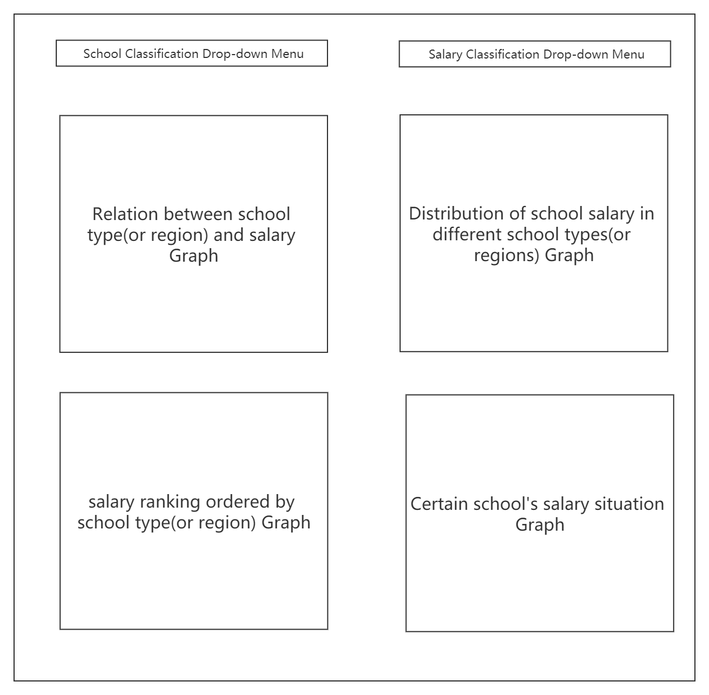
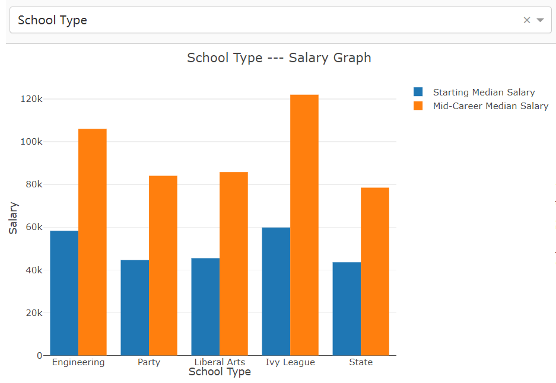
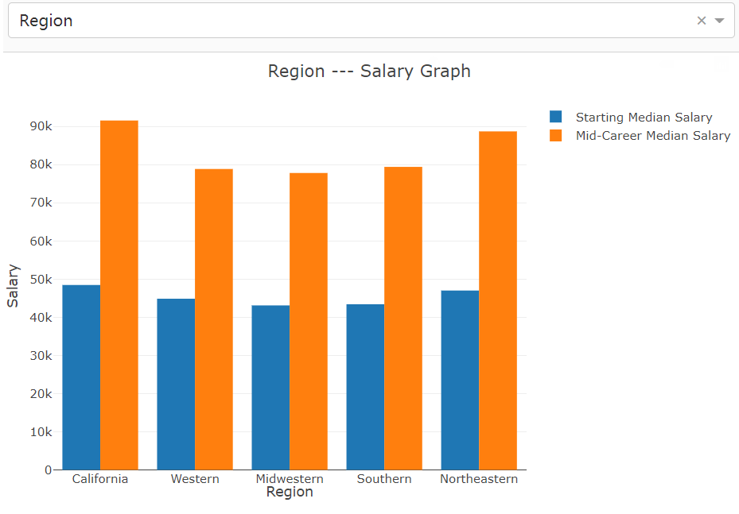
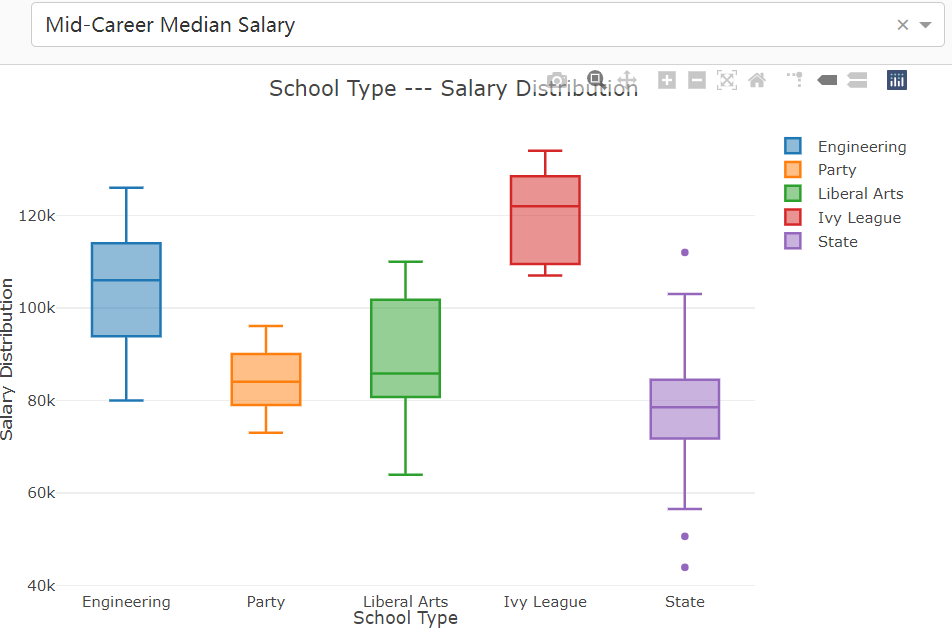
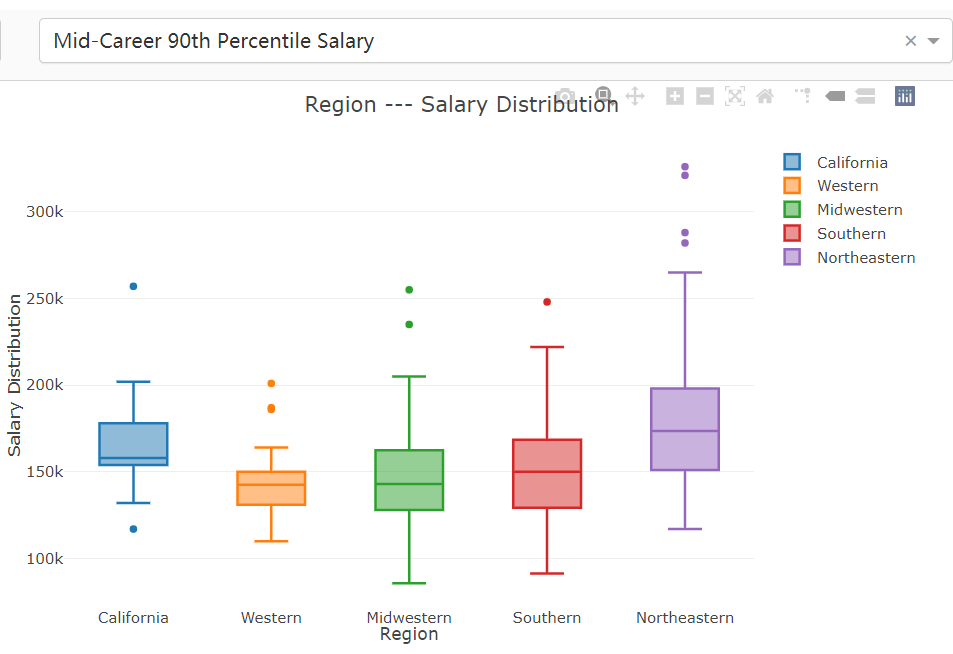
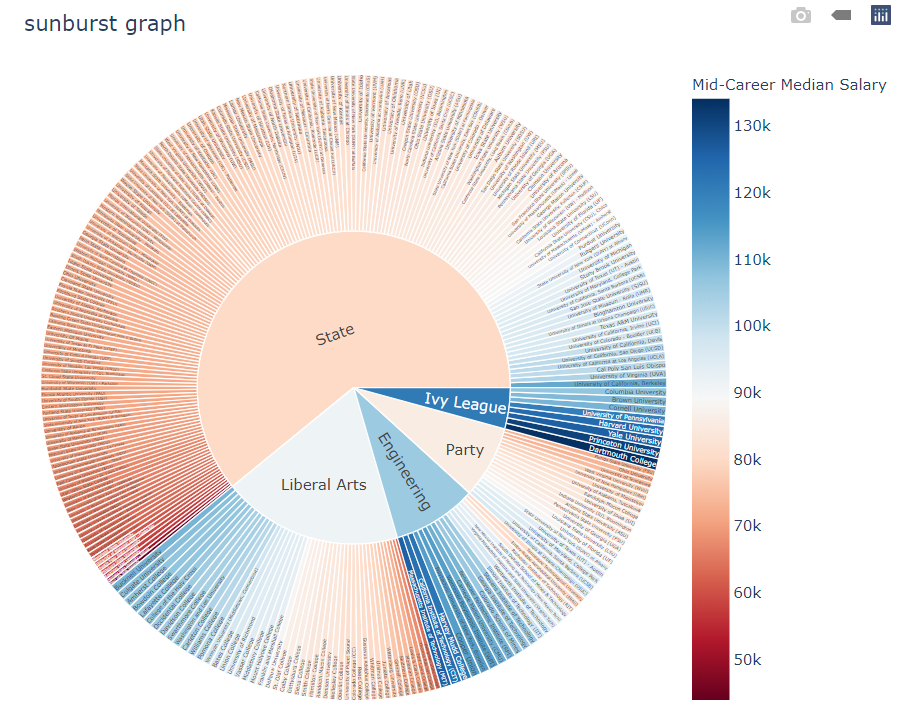
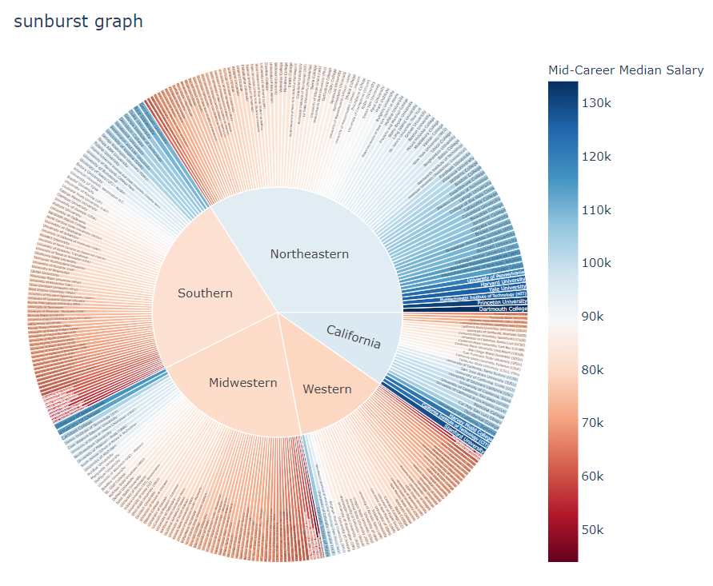
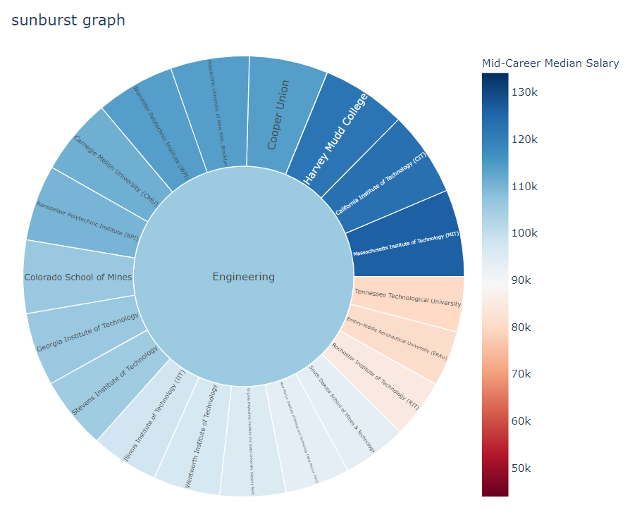
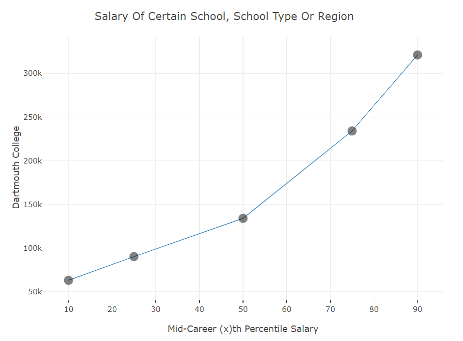
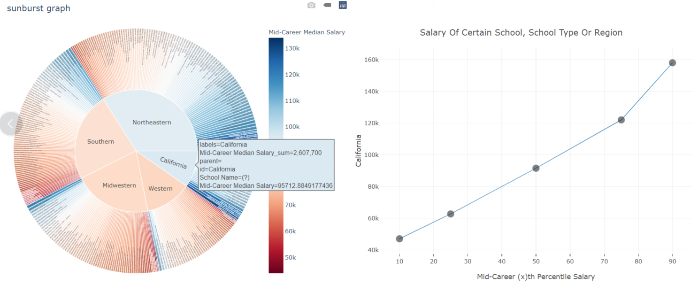

# lab-03

<center><font size='5'> Data Visualization</font></center>

<div style="page-break-after: always;"></div>

[toc]

<div style="page-break-after: always;"></div>

## Introduction

In this project , I design and implement a Dashboard for the dataset about college salaries in USA. I clear, count data and finally display them with four pictures. In these pictures, I display relation between school type(or region) and salary, distribution of school salary in different school types(or regions), salary ranking ordered by school type(or region)  and certain school's salary situation.


### Requirements of data visualization task

| ***Task Categories***         | ***Task Types***                                             |
| ----------------------------- | ------------------------------------------------------------ |
| *Data and view specification* | **Visualize** data by choosing visual encodings  <br/>**Filter** out data to focus on relevant items<br/> **Sort** items to expose patterns <br/>**Derive** values of models from source data |
| *View manipulation*           | **Select** items to highlight, filter, or manipulate <br/>**Navigate** to examine high-level patterns and low level detail<br/>**Coordinate** views for linked exploration <br/>**Organize** multiple windows and workspaces |
| *Process and provenance*      | **Record** analysis histories for revisitation, review, and sharing <br/>**Annotate** patterns to document findings <br/>**Share** views and annotations to enable collaboration <br/>**Guide** users through analysis tasks or stories |


### Development Environment

- **Development Environment:** ```Win 10```

- **Development Software:**

  ​	**PyCharm** *2021.1.2(Professional Edition)*

- **Development Language:**

  ``` Python 3.8.2```

- **Mainly Reference Count:**

  1. dash(dash_core_components, dash_html_components)
  2. dash.dependencies (Input, Output)
  3. pandas
  4. plotly(plotly.graph_objs, plotly.express)

- **Others:**

  Use some **third-party CSS library** : https://codepen.io/chriddyp/pen/bWLwgP.css


### Project Structure

```
      root folder  
      │
      └───datasets
      |        │────degrees-that-pay-back.csv
      |        │────salaries-by-college-type.csv
      |        │────salaries-by-region.csv
      └───src
      |   │───app.py
      |   │───DataProcess.py
      | 
      | readme.md
      | report.pdf
```


### Function Provide

- Select showing data between **schools and school types** or **schools and regions**    (menu 1)
- Select showing data about **different salary types**(such as  'Starting Median Salary', 'Mid-Career 10th Percentile Salary' and so on)    (menu 2)
- Show picture about relation between **school type(or region) and salary**    (Grape 1)
- Show picture about **distribution of school salary** in different school types(or regions)    (Grape 2)
- Show picture about **salary ranking** ordered by 'Mid-Career Median Salary' in certain school type(or region)   (Grape 3)
- Show picture about **certain school's salary situation**    (Grape 4)
- Grape 1 and Grape 3 is determined by the value of menu 1
- Grape 2 is determined by both the value of menu 1 and the value of menu 2
- Data Grape 4 showing will change according to the location of mouse. When mouse hovers on a certain university, region or college type on Grape 3, Grape 4 will show the data of this university region or college type 


### How to run

1. Enter the root file folder 
3. Find the directory called "**src**" and enter
3. Start the server by running app.py
```
  python app.py 
```
4. Once the server starts up, access [http://localhost:8090](http://localhost:8090/) to get the UI.

5. Interact with UI by click drop-down menu or click graph.


## Dataset description

In this project, I use the dataset about college salaries. You can find data files in the directory called ''datasets/college-salaries'. Characteristics of the dataset include School Name, School Type, Region, Starting Median Salary, Mid-Career Median Salary, Mid-Career 10th Percentile Salary, Mid-Career 25th Percentile Salary, Mid-Career 75th Percentile Salary and Mid-Career 90th Percentile Salary. 


## Function Display and realization

### Page layout

#### Describe

I design six components totally. The position and name of them are displayed following. 


#### Display




|                       components name                        | simplified name |
| :----------------------------------------------------------: | :-------------: |
|             School Classification Drop-down Menu             |    $Menu_1$     |
|             Salary Classification Drop-down Menu             |    $Menu_2$     |
|   Relation between school type(or region) and salary Graph   |    $Graph_1$    |
| Distribution of school salary in different school types(or regions) Graph |    $Graph_2$    |
|    salary ranking ordered by school type(or region) Graph    |    $Graph_3$    |
|           Certain school's salary situation Graph            |    $Graph_4$    |


- To simplify this document, I will call these components **with simplified names** next.
- Concrete introduction of these components will be written in the following.


### drop-down menu

#### School Classification Drop-down Menu

##### Describe

- The simplified name of this component is $Menu_1$
- Options users can choose include 'School Type' and 'Region', default value is 'School Type'


##### Display


##### Realization

In this part, I design this drop-down menu's options, default value, position and size.

```python
app.layout = html.Div([
    html.Div([

        html.Div([
            dcc.Dropdown(
                id='school_type_or_region',
                options=[{'label': i, 'value': i} for i in ['School Type', 'Region']],
                value='School Type'
            )
        ],
            style={'width': '49%', 'display': 'inline-block'}),

    ... 

])
```


#### Salary Classification Drop-down Menu

##### Describe

- The simplified name of this component is $Menu_2$
- Options users can choose include 'Starting Median Salary', 'Mid-Career Median Salary', 'Mid-Career 10th Percentile Salary', 'Mid-Career 25th Percentile Salary', 'Mid-Career 75th Percentile Salary' and 'Mid-Career 90th Percentile Salary', default value is 'Mid-Career Median Salary'


##### Display


##### Realization

In this part, I design this drop-down menu's options, default value, position and size.

```python
app.layout = html.Div([
    html.Div([
		
        ...
        
        html.Div([
            dcc.Dropdown(
                id='salary_type',
                options=[{'label': i, 'value': i} for i in get_salary_type()],
                value='Mid-Career Median Salary'
            )
        ], style={'width': '49%', 'float': 'right', 'display': 'inline-block'})

    ... 

])
```


### Graph

#### Relation between school type(or region) and salary

##### Describe

- The simplified name of this component is $Graph_1$

- $Graph_1$ is a histogram

- $Graph_1$ will change if $Menu_1$'s value changes

- 'Starting Median Salary' and 'Mid-Career Median Salary' of a certain school type (or region) in this picture refer to the median salary of all universities in this same school type (or region)

- > This picture show 'Starting Median Salary' and 'Mid-Career Median Salary' of different school types(or regions). We can use it to compare the **salary disparity** and **future development** of different school types(or regions)


##### Display

**Picture when $Menu_1$'s  value is 'School Type'**




**Picture when $Menu_1$'s  value is 'Region'**




##### Realization

In this part, I design this graph's id , position and size.

```python
app.layout = html.Div([
    
    ...
    
    html.Div([
        dcc.Graph(
            # 左边的柱状图
            id='start_mid_salary_compare',

        )
    ], style={'width': '49%', 'display': 'inline-block', 'padding': '0 20'}),

    ... 

])
```


In this part, I provide the data this graph needing according to $Menu_1$'s value

```python
@app.callback(
    dash.dependencies.Output('start_mid_salary_compare', 'figure'),
    [dash.dependencies.Input('school_type_or_region', 'value')])
def update_start_mid_salary_compare_graph(school_type_or_region):
    graph_date = get_start_mid_salary_compare_data(school_type_or_region)
    trace_1 = go.Bar(
        x=graph_date['x'],
        y=graph_date['Starting Median Salary'],
        name='Starting Median Salary'
    )
    trace_2 = go.Bar(
        x=graph_date['x'],
        y=graph_date['Mid-Career Median Salary'],
        name='Mid-Career Median Salary'
    )

    trace = [trace_1, trace_2]
    layout = go.Layout(
        title=school_type_or_region + ' --- Salary Graph',
        # 横坐标设置
        xaxis={
            'title': school_type_or_region,
        },
        # 纵坐标设置
        yaxis={
            'title': 'Salary',
        },
        margin={'l': 50, 'b': 30, 't': 50, 'r': 0},
        height=450,
        hovermode='closest'
    )
    return {
        'data': trace,
        'layout': layout
    }


# 图像start_mid_salary_compare_data的数据
def get_start_mid_salary_compare_data(school_type_or_region):
    if school_type_or_region == 'School Type':
        return {'x': get_school_types(),
                'Starting Median Salary': get_media_salary_by_school_type
                (df_school_type, 'Starting Median Salary'), 'Mid-Career Median Salary':
                    get_media_salary_by_school_type(df_school_type, 'Mid-Career Median Salary')}
    else:
        return {'x': get_school_regions(),
                'Starting Median Salary': get_media_salary_by_school_region
                (df_school_region, 'Starting Median Salary'), 'Mid-Career Median Salary':
                    get_media_salary_by_school_region(df_school_region, 'Mid-Career Median Salary')}
```


#### Distribution of school salary in different school types(or regions)

##### Describe

- The simplified name of this component is $Graph_2$

- $Graph_2$ is a box diagram

- $Graph_2$ will change if $Menu_1$'s value or $Menu_2$'s value change

- >  In this graph, we can get and compare the  **salary distribution** of different school types in different Salary Classification. We can use this graph to view if this school type(or region) is equal wage distribution.


##### Display

**$Menu_1$'s value is 'School Type', $Menu_2$'s value is 'Mid-Career Median Salary'**




**$Menu_1$'s value is 'Region', $Menu_2$'s value is 'Mid-Career 90th Percentile Salary'**




##### Realization

In this part, I design this graph's id , position and size.

```python
app.layout = html.Div([
    
    ...
    
    html.Div([
        # 右边的箱型图
        dcc.Graph(id='salary_box')
    ], style={'display': 'inline-block', 'width': '49%'}),

    ... 

])
```


In this part, I provide the data this graph needing according to $Menu_1$'s value and $Menu_2$'s value

```python
@app.callback(
    dash.dependencies.Output('salary_box', 'figure'),
    [dash.dependencies.Input('school_type_or_region', 'value'),
     dash.dependencies.Input('salary_type', 'value')])
def update_salary_box_graph(school_type_or_region, salary_type):
    graph_date = get_salary_box_data(school_type_or_region, salary_type)
    trace = []
    for i in range(len(graph_date['x'])):
        trace.append(go.Box(y=np.array(graph_date['y'][i])[0], name=graph_date['x'][i]))

    layout = go.Layout(
        title=school_type_or_region + ' --- Salary Distribution',
        # 横坐标设置
        xaxis={
            'title': school_type_or_region,
        },
        # 纵坐标设置
        yaxis={
            'title': 'Salary Distribution',
        },
        margin={'l': 50, 'b': 30, 't': 50, 'r': 0},
        height=450,
        hovermode='closest'
    )
    return {
        'data': trace,
        'layout': layout
    }
```


#### salary ranking ordered by school type(or region)

##### Describe

- The simplified name of this component is $Graph_3$

- $Graph_3$ is a sunburst diagram

- $Graph_3$ will change if $Menu_1$'s value changes

- In inner ring, I display all school types or regions possible. Each school type or region is a sector, and the center angle of this sector is determined by the number of members of each school type (or region). The data outer this section is the universities in this school type (or region) sorting by 'Mid-Career Median Salary'. The color of universities represent the salary of them .The bluer the color, the higher the salary, and the redder the color, the lower the salary.

- If you click one of inner section, it will show data all in this school type(or region).

- >  In this graph,  we can get **salary ranking** ordered by 'Mid-Career Median Salary' in certain school type(or region)


##### Display

**Picture when $Menu_1$'s  value is 'School Type'**




**Picture when $Menu_1$'s  value is 'Region'**




**Picture when $Menu_1$'s  value is 'School Type', and we click part 'Engineering'**




##### Realization

In this part, I design this graph's id , position and size.

```python
app.layout = html.Div([
    
    ...
    
    html.Div([
        # 下边的Sunburst图
        dcc.Graph(id='sunburst_salary_box'),

    ], style={'display': 'inline-block', 'width': '49%'}),

    ... 

])
```


In this part, I provide the data this graph needing according to $Menu_1$'s value

```python
@app.callback(
    dash.dependencies.Output('sunburst_salary_box', 'figure'),
    [dash.dependencies.Input('school_type_or_region', 'value')])
def update_sunburst_salary_box_graph(school_type_or_region):
    graph_date = get_data(school_type_or_region)
    fig = px.sunburst(
        graph_date,
        path=[school_type_or_region, 'School Name'],
        values='Mid-Career Median Salary',
        branchvalues='total',
        color='Mid-Career Median Salary',
        color_continuous_scale='RdBu',
        title='sunburst graph',
        hover_data=['School Name']

    )

    fig.layout.height = 600
    fig.layout.margin = {'l': 50, 'b': 30, 't': 50, 'r': 0}
    fig.layout.title = 'sunburst graph'
    fig.layout.hovermode = 'closest'

    return {
        'data': fig.data,
        'layout': fig.layout
    }

```


#### Certain school's salary situation

##### Describe

- The simplified name of this component is $Graph_4$
- $Graph_4$ is a line chart
- Data $Graph_4$ showing will change according to the location of mouse. When mouse hovers on a certain university, region or college type on $Graph_3$, $Graph_4$ will show the data of this university region or college type 
- If mouse hovers on a certain university on $Graph_3$, $Graph_4$ will show the salary data of this university
- If mouse hovers on a region or college type on $Graph_3$, $Graph_4$ will show the median salary data of the universities in this region(or college type)

- > This picture show salary of a certain university, region or college type . We can use it to estimate upper and lower limits of it.


##### Display

**When mouse hover on a university on $Graph_3$, $Menu_1$'s value is 'Region'**




**When mouse hover on a region on $Graph_3$, $Menu_1$'s value is 'Region'**




##### Realization

In this part, I design this graph's id , position and size.

```python
app.layout = html.Div([
    
    ...
    
   html.Div([
        # 具体学校的图片
        dcc.Graph(id='certain_school'),
    ], style={'display': 'inline-block', 'width': '49%'}),

])
```


In this part, I provide the data this graph needing according to mouse position on $Grape_3$ and $Menu_1$'s value

```python
@app.callback(
    dash.dependencies.Output('certain_school', 'figure'),
    [dash.dependencies.Input('sunburst_salary_box', 'hoverData'),
     dash.dependencies.Input('school_type_or_region', 'value')])
def update_certain_school_graph(hoverData, school_type_or_region):
    school_name = hoverData['points'][0]['label'].strip()
    graph = get_data(school_type_or_region)
    yArray = []
    if school_name not in get_school_regions() and school_name not in get_school_types():
        dff = graph[graph['School Name'] == school_name]
        yArray = np.array(dff)[0][3:]
    elif school_name in get_school_types():
        yArray = get_media_salary_by_certain_school_type(graph, school_name)
    elif school_name in get_school_regions():
        yArray = get_media_salary_by_certain_school_region(graph, school_name)
    adjust_array_data(yArray)

    return {
        'data': [go.Scatter(
            x=['10', '25', '50', '75', '90'],
            y=yArray,
            mode='lines+markers',
            line=dict(
                color='rgba(255, 182, 193)',
                width=1
            ),
            marker={
                'size': 15,
                'opacity': 0.5,
                'line': {'width': 0.5, 'color': 'white'}
            }
        )],
        'layout': go.Layout(
            title='Salary Of Certain School, School Type Or Region',
            # 横坐标设置
            xaxis={
                'title': 'Mid-Career (x)th Percentile Salary',
                'tickmode': 'auto', 'nticks': 10, 'tickwidth': 0.1,
            },
            # 纵坐标设置
            yaxis={
                'title': school_name,
            },
            margin={'l': 60, 'b': 80, 't': 50, 'r': 0},
            height=550,
            width=700,
            hovermode='closest'
        )
    }

```


### Others

#### Data Handling

Salary data dataset files provided is string with symbols ',' and '$', so we can't use then directly. We should remove these symbols from salary data.

For every salary data (not null), I handle it with the function in python called 'replace'.


**code:**

```python
df_school_type = pd.read_csv(
    '../datasets/college-salaries/salaries-by-college-type.csv')
df_school_region = pd.read_csv(
    '../datasets/college-salaries/salaries-by-region.csv')


def dataInit():
    global df_school_type, df_school_region
    df_school_type = data_handle(df_school_type)
    df_school_region = data_handle(df_school_region)


# 数据处理，把数据中的'$'与','符号去除
def data_handle(df):
    ls = ['Starting Median Salary', 'Mid-Career Median Salary', 'Mid-Career 10th Percentile Salary',
          'Mid-Career 25th Percentile Salary', 'Mid-Career 75th Percentile Salary',
          'Mid-Career 90th Percentile Salary']
    for column in ls:
        for i in range(len(df[column])):
            if str(df[column][i]) != 'nan':
                df[column][i] = df[column][i][1:-1].replace(',', '').strip(" ")
    return df


```

